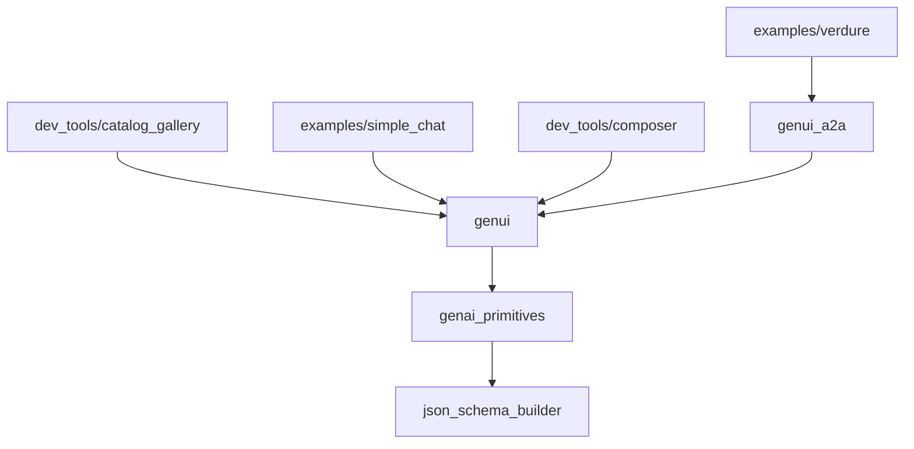

# GenUI 框架定位与 A2UI 关系

> 基于源码:`D:\code\a_dart\prj\fr\.claude\repo\flutter_genui`
> 所有结论均引用源码 `file_path:line_range`,并附关键代码片段。

---

## 1. flutter_genui 是什么

**flutter_genui** 是 Flutter 团队开源的 **Generative UI SDK**(GenUI for Flutter),核心目标是把 LLM / Agent 输出的"文字墙"替换成 **运行时动态、可交互的图形 UI**。它的实现严格遵循 [A2UI 协议 v0.9](https://a2ui.org),在 Flutter 端作为一个 **A2UI 渲染器(renderer)** 存在。

源码依据 `README.md:1-24`:

```
1  # Generative UI SDK for Flutter (genui)
...
17  Our goal for the GenUI SDK for Flutter is to help you replace static "walls of text" from your LLM with
18  dynamic, interactive, graphical UI.
19  It uses a JSON-based format to compose UIs from your existing widget catalog, turning
20  conversations or agent interactions into rich, intuitive experiences. State changes in the UI update
21  a client-side data model, which is fed back to the agent, creating a
22  powerful, high-bandwidth interaction loop.
```

`README.md:115-119` 进一步明确 A2UI 定位:

```
115 ## A2UI Support
116
117 The Flutter Gen UI SDK uses the [A2UI protocol](https://a2ui.org) to represent UI content internally. The [genui_a2a](packages/genui_a2a/) package allows it to act as a renderer for UIs generated by an A2UI backend agent, similar to the [other A2UI renderers](https://github.com/google/A2UI/tree/main/renderers) which are maintained within the A2UI repository.
118
119 The Flutter Gen UI SDK currently supports A2UI v0.9.
```

它的核心特征(与 A2UI 上游协议保持一致):

| 特征 | 含义 | 证据 |
|---|---|---|
| **JSON-based** | UI 由 JSON 描述而非生成代码 | `README.md:65-67` "This UI is not generated in the form of code; rather, it's generated at runtime based on a widget catalog" |
| **Widget Catalog 驱动** | 渲染端持有 widget 目录,LLM 选择其中组件 | `README.md:71-72` "Leverage Your Widget Catalog" |
| **数据绑定 / 状态回环** | UI 状态改变会回传到 Agent | `README.md:73-75` "Interactive State Feedback" |
| **后端无关** | 任何 LLM / Agent 后端都能驱动 | `README.md:85-88` "The `genui` framework is designed to be backend agnostic" |

---

## 2. 与 A2UI 上游的关系

A2UI 协议本体在 `google/A2UI` 仓库维护;flutter_genui **复用同一份 JSON 协议格式**(v0.9 的 envelope),但在 Flutter 端 **重新实现了**:

- **数据模型层**(`packages/genui/lib/src/model/`)
- **运行时引擎**(`packages/genui/lib/src/engine/`)
- **传输层**(`packages/genui/lib/src/transport/`)
- **Widget Catalog**(`packages/genui/lib/src/catalog/basic_catalog_widgets/` — 18 个内置 widget)

源码依据 `packages/genui/lib/genui.dart:5-12`:

```
5   /// The generative UI framework (GenUI) for Flutter and Dart.
6   ///
7   /// This library provides the necessary components to build generative user
8   /// interfaces in Flutter applications. It implements the A2UI protocol
9   /// (https://a2ui.org), and includes an object model for UI components,
10  /// data handling, and provides transport for communicating with generative AI
11  /// services (agents and LLMs).
```

A2UI v0.9 的四种 envelope 在 `packages/genui/lib/src/model/a2ui_message.dart:15-87` 中以 sealed class 形式重新建模:

- `CreateSurface` (新建 surface)
- `UpdateComponents` (更新 surface 上的组件)
- `UpdateDataModel` (更新数据模型)
- `DeleteSurface` (删除 surface)

每个都要求 `version == "v0.9"`(`a2ui_message.dart:22-28`)。

> 与上游 A2UI 的关系:**共享协议格式,实现独立**。flutter_genui 仓库内的 `submodules/a2ui` 持有 A2UI 规范作为参考(见 `.agent/skills/genui-helper/SKILL.md:53-57`),但运行时用的是 `packages/genui/` 自己实现的消息模型。

---

## 3. 五个包的作用与依赖关系

源码依据 `pubspec.yaml` 与 `README.md:104-113` 的依赖图:



### 3.1 `genui` — 核心框架
**作用**:A2UI 协议在 Flutter 端的运行时实现,包含消息模型、Surface 引擎、数据模型、传输适配器、Widget Catalog、Prompt 构造器、UI Widget。

源码依据 `packages/genui/lib/genui.dart:14-24`:
```
14  export 'src/catalog.dart';
15  export 'src/development_utilities.dart';
16  export 'src/engine.dart' hide SurfaceAdded, SurfaceRemoved;
17  export 'src/facade.dart';
18  export 'src/functions.dart';
19  export 'src/interfaces.dart';
20  export 'src/model.dart';
21  export 'src/primitives.dart';
22  export 'src/transport.dart';
23  export 'src/utils.dart';
24  export 'src/widgets.dart';
```

### 3.2 `genui_a2a` — A2A 协议客户端
**作用**:把 Flutter 端接进 [A2A(Agent-to-Agent)](https://a2a.dev) 后端,自动处理 SSE / HTTP / Agent Card。

源码依据 `packages/genui_a2a/lib/genui_a2a.dart:5`:
```
5   export 'src/a2ui_agent_connector.dart';
```

主类 `A2uiAgentConnector` 在 `packages/genui_a2a/lib/src/a2ui_agent_connector.dart:28-53`,它内含一个 `A2AClient` + `SseTransport`,并自动注入 A2UI 扩展头:
```
18  final Uri a2uiExtensionUri = Uri.parse(
19    'https://a2ui.org/a2a-extension/a2ui/v0.9',
20  );
...
44          A2AClient(
45            url: url.toString(),
46            log: _log,
47            transport: SseTransport(
48              url: url.toString(),
49              log: _log,
50              authHeaders: {'X-A2A-Extensions': a2uiExtensionUri.toString()},
51            ),
52          ),
```

### 3.3 `genai_primitives` — 通用数据结构
**作用**:为 GenAI 应用提供的、与技术无关的原始类型(`README.md:97` "technology-agnostic primitive types")。

### 3.4 `json_schema_builder` — JSON Schema
**作用**:完整的 Dart JSON Schema 包,带校验,被 `genui` 用来定义 widget 数据结构(`README.md:98`)。

### 3.5 `a2ui_core` — 内部替代实现
**作用**:仓库内 `packages/a2ui_core/` 目录也存在一份 **协议无关** 的 A2UI 核心实现(`messages.dart` / `catalog.dart` / `surface_model.dart` / `processor.dart` / `binder.dart`),使用基于 `Signal` 的响应式抽象(`a2ui_core/lib/src/rendering/binder.dart:14-50`)。**注意**:它是仓库内并行存在的备选实现,不暴露在主 pub graph(`README.md` 不列),主路径仍走 `packages/genui/`。

### 3.6 工具与示例

| 目录 | 用途 |
|---|---|
| `examples/simple_chat/` | 用 Gemini API + Dartantic 跑 A2UI 聊天的最小例子(无 A2A 服务) |
| `examples/verdure/` | Python A2UI server + Flutter client 配对的完整示例(走 A2A + HTTP/SSE) |
| `dev_tools/catalog_gallery/` | 浏览/测试所有 catalog widget |
| `dev_tools/composer/` | 手动编辑/调试 A2UI envelope 的工具 |

---

## 4. 整体架构图(文字描述)

```
┌──────────────────────────────────────────────────────────────────┐
│  AI Service (LLM / Agent)                                        │
│  1) 输出 markdown ```json ... ``` 块 或 JSONL 序列               │
│  2) 或 A2A backend 推送 SSE 事件 (data: {...})                    │
└──────────────────────────────────────────────────────────────────┘
                       │
                       ▼
┌──────────────────────────────────────────────────────────────────┐
│  Transport 层                                                     │
│  ├─ A2uiTransportAdapter (packages/genui/lib/src/transport/      │
│  │     a2ui_transport_adapter.dart)  ← 推模式:外部 feed 文本块   │
│  └─ A2uiAgentConnector (genui_a2a)  ← 拉模式:HTTP/SSE + A2A      │
└──────────────────────────────────────────────────────────────────┘
                       │  Stream<A2uiMessage>
                       ▼
┌──────────────────────────────────────────────────────────────────┐
│  Engine 层 (SurfaceController)                                    │
│  ├─ A2uiParserTransformer — 解析 markdown JSON / 平衡 JSON        │
│  ├─ SurfaceRegistry — 多 surface 生命周期 + ValueNotifier        │
│  ├─ DataModelStore — 每 surface 一份 DataModel(响应式)            │
│  └─ DataPath — 路径解析(/a/b/0)                                  │
└──────────────────────────────────────────────────────────────────┘
                       │  Stream<SurfaceUpdate>
                       ▼
┌──────────────────────────────────────────────────────────────────┐
│  Facade 层                                                        │
│  ├─ Conversation — 把 transport + controller 串成面向事件的 API   │
│  └─ PromptBuilder — 给 LLM 生成系统提示(catalog schema + 规则)    │
└──────────────────────────────────────────────────────────────────┘
                       │  ValueListenable<SurfaceDefinition?>
                       ▼
┌──────────────────────────────────────────────────────────────────┐
│  Widget 层                                                        │
│  ├─ Surface (StatefulWidget) — 监听 definition 重建 widget 树    │
│  ├─ Catalog — 18 个内置 widget 的注册表                           │
│  └─ UserActionEvent → onSubmit ChatMessage 回到 transport         │
└──────────────────────────────────────────────────────────────────┘
```

---

## 5. 关键入口文件

按"调用顺序"排列:

| 阶段 | 文件 | 行数 | 作用 |
|---|---|---|---|
| 主导出 | `packages/genui/lib/genui.dart` | 25 | 包入口,re-export 所有子模块 |
| 引擎 | `packages/genui/lib/src/engine/surface_controller.dart` | 333 | `SurfaceController`,整个运行时核心 |
| 引擎 | `packages/genui/lib/src/engine/surface_registry.dart` | 129 | 多 surface 注册表 |
| 引擎 | `packages/genui/lib/src/engine/data_model_store.dart` | 44 | 数据模型存储 |
| 传输 | `packages/genui/lib/src/transport/a2ui_transport_adapter.dart` | 97 | 文本流 → A2UI 消息的适配器 |
| 传输 | `packages/genui/lib/src/transport/a2ui_parser_transformer.dart` | 275 | 流式 JSON / markdown 解析 |
| 协议 | `packages/genui/lib/src/model/a2ui_message.dart` | 259 | 4 种 A2UI envelope 模型 |
| 协议 | `packages/genui/lib/src/model/a2ui_schemas.dart` | — | JSON Schema 定义(给 LLM 看的契约) |
| Catalog | `packages/genui/lib/src/model/catalog.dart` | 264 | Catalog 容器 + schema 动态生成 |
| Catalog | `packages/genui/lib/src/catalog/basic_catalog.dart` | 200 | 18 个内置 widget 装配 |
| Facade | `packages/genui/lib/src/facade/conversation.dart` | 209 | 对外事件流 API |
| Facade | `packages/genui/lib/src/facade/prompt_builder.dart` | 393 | System prompt 构造 |
| Widget | `packages/genui/lib/src/widgets/surface.dart` | 226 | 渲染入口 `Surface` widget |
| Widget | `packages/genui/lib/src/model/data_model.dart` | 563 | 响应式 DataModel(`subscribe` + `bindExternalState`) |
| A2A | `packages/genui_a2a/lib/src/a2ui_agent_connector.dart` | 363 | A2A 客户端连接器 |
| A2A | `packages/genui_a2a/lib/src/a2a/client/a2a_client.dart` | 457 | JSON-RPC 2.0 客户端 |
| A2A | `packages/genui_a2a/lib/src/a2a/client/sse_transport.dart` | 91 | SSE 传输 |
| A2A | `packages/genui_a2a/lib/src/a2a/client/sse_parser.dart` | 101 | SSE 行解析 |
| 接口 | `packages/genui/lib/src/interfaces/transport.dart` | 29 | Transport 抽象接口 |
| 接口 | `packages/genui/lib/src/interfaces/surface_host.dart` | 24 | SurfaceHost 抽象接口 |

---

## 6. 总结

- **flutter_genui = Flutter 端的 A2UI v0.9 渲染器 + Agent 客户端**,与 google/A2UI 共享 JSON 协议但实现独立。
- 内部由 **5 个包** 组成:`genui`(核心)+ `genui_a2a`(A2A 网络)+ `genai_primitives`(原始类型)+ `json_schema_builder`(Schema)+ `a2ui_core`(内部备选实现,未进入主图)。
- 架构自上而下:**AI 服务 → Transport(A2uiTransportAdapter / A2uiAgentConnector) → Engine(SurfaceController/SurfaceRegistry/DataModelStore) → Facade(Conversation) → Widget(Surface + Catalog)**。
