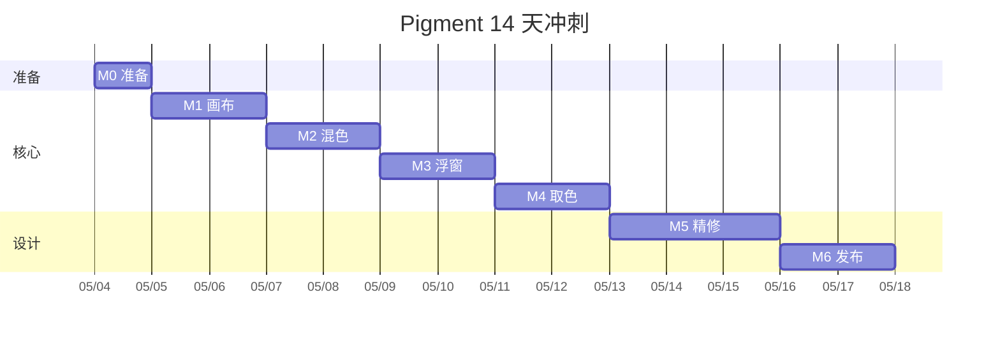

# 项目代号 · Pigment

一个常驻 Android 桌面的悬浮挂件:屏幕任意位置取色 + 真实颜料调色画板,极简玻璃 UI + 真实颜料质感。

<aside>
🎯

 **目标** :**14 天内**做出可日常自用的 Beta 版,体验对标  *Procreate Color Companion × Arc 浮窗 × Pixolor* 。

 **单人开发假设** :每天有效投入 2–4 小时。

</aside>

---

## 一、技术栈(已锁定,不再讨论)

| 层          | 选型                                                             | License    |
| ----------- | ---------------------------------------------------------------- | ---------- |
| 平台        | Kotlin + Jetpack Compose,minSdk 33 (Android 13),targetSdk 34     | —         |
| 笔触        | `androidx.ink`1.0                                              | Apache-2.0 |
| 混色        | AGSL `RuntimeShader`•`mixbox.agsl`                          | MIT        |
| 浮窗        | `WindowManager`•`ComposeView`(`TYPE_APPLICATION_OVERLAY`) | 系统       |
| 取色        | `MediaProjection`•`ImageReader`                             | 系统       |
| 模糊 / 玻璃 | `dev.chrisbanes.haze:haze`                                     | Apache-2.0 |
| 形状        | `androidx.graphics.shapes`                                     | Apache-2.0 |
| 配色        | Radix Colors 移植                                                | MIT        |
| 字体        | Geist + Inter + JetBrains Mono + 思源黑体                        | OFL / SIL  |
| 持久化      | DataStore (色板) + Room (笔迹)                                   | Apache-2.0 |
| 图标        | Lucide 基底 + 6 个自绘 `ImageVector`                           | ISC        |

---

## 二、里程碑(7 个阶段 / 14 天)

| 阶段    | 时间         | 产出                                   |
| ------- | ------------ | -------------------------------------- |
| M0 准备 | Day 0 (半天) | 工程骨架 + 主题 token + 资源齐备       |
| M1 画布 | Day 1–2     | Compose Canvas + ink 笔触 + 撤销       |
| M2 混色 | Day 3–4     | mixbox AGSL + 蓄色 + 纸纹 + 湿边       |
| M3 浮窗 | Day 5–6     | 气泡 ↔ 面板 + 拖动吸边 + 前台服务     |
| M4 取色 | Day 7–8     | MediaProjection + 放大镜 + 仪式动效    |
| M5 精修 | Day 9–11    | 动效 / 图标 / 暗色 / Haptic / 色板抽屉 |
| M6 发布 | Day 12–13   | 自签 APK + 自用 + Bugfix               |



---

## 三、Day 0 · 准备清单(今天就能做)

### 环境

* [ ] Android Studio Hedgehog 或更新版本
* [ ] 真机一台,Android 13+, **确认 Pointer 压感可用** (MotionEvent.getPressure 测试)
* [ ] 新建工程 `com.luoxinyi.pigment`,Compose,Empty Activity

### 工程骨架

```
app/src/main/
├── AndroidManifest.xml
├── MainActivity.kt
├── ui/
│   ├── theme/  (Theme/Color/Typography/Shapes/Motion)
│   ├── icons/  (IcEyedropper, IcBrush, IcEraser…)
│   └── components/  (GlassSurface, ColorChip, HexLabel, Loupe)
├── canvas/
│   ├── BrushEngine.kt
│   ├── PaintCanvas.kt
│   └── shaders/  (mixbox.agsl, paper_grain.agsl, wet_edges.agsl)
├── floating/  (FloatingService, BubbleUi, PaletteUi)
├── picker/    (ScreenCaptureService, LoupeOverlay)
└── data/      (PaletteStore, StrokeDao)
```

### 资源拉取

* [ ] `git clone <https://github.com/scrtwpns/mixbox`> → 复制 `mixbox.glsl` 到 `assets/shaders/mixbox.agsl`(基本无需改)
* [ ] 下载字体:Geist ([vercel.com/font)、Inter](http://vercel.com/font)、Inter) ([rsms.me/inter)、JetBrains](http://rsms.me/inter)、JetBrains) Mono、思源黑体 → `res/font/`
* [ ] 拉 Radix Colors JSON,写一段 Kotlin 脚本生成 `RadixColors.kt`(每色 12 阶 × 9 色相)
* [ ] 拉 Lucide SVG 6 张:eyedropper / brush / eraser / undo / redo / save → 转 `ImageVector`

### 依赖(粘贴到 `build.gradle.kts`)

```kotlin
dependencies {
	implementation(platform("androidx.compose:compose-bom:2024.10.00"))
	implementation("androidx.compose.ui:ui")
	implementation("androidx.compose.material3:material3")
	implementation("androidx.compose.ui:ui-tooling-preview")
	implementation("androidx.activity:activity-compose:1.9.+")

	// 笔触
	implementation("androidx.ink:ink-strokes:1.0.0-alpha04")
	implementation("androidx.ink:ink-rendering:1.0.0-alpha04")
	implementation("androidx.ink:ink-authoring:1.0.0-alpha04")
	implementation("androidx.ink:ink-brush:1.0.0-alpha04")

	// 玻璃模糊
	implementation("dev.chrisbanes.haze:haze:1.0.0")
	implementation("dev.chrisbanes.haze:haze-materials:1.0.0")

	// 现代形状
	implementation("androidx.graphics:graphics-shapes:1.0.1")

	// 持久化
	implementation("androidx.datastore:datastore-preferences:1.1.+")
	implementation("androidx.room:room-ktx:2.6.+")
	ksp("androidx.room:room-compiler:2.6.+")
}
```

### 权限(`AndroidManifest.xml`)

```xml
<uses-permission android:name="android.permission.SYSTEM_ALERT_WINDOW"/>
<uses-permission android:name="android.permission.FOREGROUND_SERVICE"/>
<uses-permission android:name="android.permission.FOREGROUND_SERVICE_MEDIA_PROJECTION"/>
<uses-permission android:name="android.permission.POST_NOTIFICATIONS"/>

<service
	android:name=".floating.FloatingService"
	android:exported="false"
	android:foregroundServiceType="mediaProjection" />
```

---

## 四、每日冲刺 · 任务 + DoD

### Day 1–2 · M1 画布

* [ ] `PaintCanvas.kt`:Compose Canvas,接收 `PointerInput` 转成 ink `InProgressStroke`
* [ ] `BrushEngine.kt`:配置一个 `BrushFamily`(默认马克笔),压感映射半径
* [ ] 离屏 `ImageBitmap` 作为画布,完成笔触提交
* [ ] 撤销 / 重做(`ArrayDeque<Stroke>`)
* [ ] 颜色选择器(临时弹窗,用 `Color.HSV` 滑杆即可,M5 再美化)

 **DoD** :能在普通页面用手指流畅画线,有压感,可撤销重做,单线绘制 60fps 不掉帧。

### Day 3–4 · M2 混色

* [ ] `mixbox.agsl`:`uniform half3 brush; uniform half t; half4 main(float2)` 简单包一层
* [ ] `RuntimeShader` 在每个 stamp 时创建,`setInputShader("canvas", canvasBitmapShader)`
* [ ] 蓄色:每个 stamp 后 `brushColor = mixboxLerpCpu(brushColor, sampledCanvas, wetness * pressure)`(CPU 端轻量采样)
* [ ] 纸纹 shader:procedural noise + `paper * 0.94`(让颜料贴纸)
* [ ] 湿边 shader:笔触边缘 alpha `pow(1-d, 2.2)` 累加

 **DoD** :蓝色笔在黄色画布上拖一笔,能看到  **明显且自然的渐变绿** ;笔尖颜色随拖动被画布同化(蓄色生效)。

### Day 5–6 · M3 浮窗

* [ ] `FloatingService` 前台服务 + 通知
* [ ] `BubbleUi`:56dp 圆,主色 = brushColor,1px 玻璃描边,呼吸 4s 1.0↔1.02
* [ ] `PaletteUi`:展开为 360×500dp 圆角矩形,玻璃模糊 (Haze)
* [ ] 拖动:`pointerInput { detectDragGestures }` 改 `lp.x/y` + `wm.updateViewLayout`
* [ ] 吸边:松手判断到屏幕中线,二阶 spring 滑到边
* [ ] 状态切换动效:380ms spring(stiffness=300, damping=0.78),气泡形变到面板
* [ ] **手动 provide** `LifecycleOwner` / `SavedStateRegistryOwner` / `ViewModelStoreOwner`(否则 Compose 会崩)

 **DoD** :任意 App 中悬浮气泡常驻、可拖、可吸边、可展开,展开动画顺滑无卡顿。

### Day 7–8 · M4 屏幕取色

* [ ] 首次启动引导请求 `SYSTEM_ALERT_WINDOW`
* [ ] 取色按钮 → `MediaProjectionManager.createScreenCaptureIntent` → 用户允许
* [ ] `ScreenCaptureService` 持有 `MediaProjection` + `VirtualDisplay` + `ImageReader`(全屏分辨率)
* [ ] 取色全屏覆盖层 `LoupeOverlay`:120dp 玻璃放大镜 + 8 倍像素 + 1px 双色准星
* [ ] HEX 胶囊跟随手指,JetBrains Mono 显示 `#7C9885 · slate-9`
* [ ] 抬手:取色完成 + Haptic + 浮窗气泡显示该色
* [ ] 取色时**自己浮窗自动隐藏**

 **DoD** :在任意 App 内点取色 → 屏幕暗化 → 出放大镜 → 移动 → 抬手,气泡变成所取色,全程 ≤ 6s。

### Day 9–11 · M5 设计精修(占总工时 30%,最重要)

* [ ] **配色** :`RadixColors.kt` 完整接入 `MaterialTheme.colorScheme`(明 / 暗双套)
* [ ] **字体** :`Typography.kt` 5 级,JetBrains Mono 专用于 HEX
* [ ] **形状** :用 `MaterialShapes.Cookie` / `Pebble` 替换默认圆角
* [ ] **图标** :`IcEyedropper` 等 6 个自绘 `ImageVector`(线宽 1.75px,round cap)
* [ ] **动效** :全局 spring 配置,放大镜出现 220ms,色块 hover 120ms,撤销 240ms 渐隐
* [ ] **取色仪式** :抬手时一滴颜料从放大镜飞回气泡(`Animatable<Offset>` + 抛物线)
* [ ] **色板抽屉** :面板底部上滑,色块 hover scale 1.08,长按删除
* [ ] **暗色模式** :重新校 surface / outline / shadow,确认夜间不刺眼
* [ ] **Haptic** :取色完成 / 撤销 / 保存色板各一种,默认开;音效默认关
* [ ] **气泡心跳** :剪贴板含 `#xxxxxx` 时震动 2 次
* [ ] **空状态 / 引导页** :首次打开的 3 屏引导(权限 + 玩法)

 **DoD** :任何一帧截图发到设计师朋友圈,看起来都像产品级 App,不像 Demo。

### Day 12–13 · M6 发布 / 自用

* [ ] 生成签名 keystore + 打 release APK
* [ ] 自用 3 天,记录 Bug 与不爽点
* [ ] 修关键 Bug,迭代到 v0.2
* [ ] (可选)上 GitHub 开源,README 用 mood board 截图

 **DoD** :连续自用 3 天, **不再想打开 Pixolor / Color Grab** 。

---

## 五、风险登记 & 应对

| 风险                                       | 概率 | 影响               | 应对                                                                    |
| ------------------------------------------ | ---- | ------------------ | ----------------------------------------------------------------------- |
| AGSL `RuntimeShader`在某些 ROM 性能不足  | 中   | 笔触掉帧           | 降级 4 系数 LUT CPU 版 mixbox(预先准备好)                               |
| `MediaProjection`Android 14 类型校验失败 | 高   | 取色不可用         | `foregroundServiceType="mediaProjection"`• 严格 startForeground 顺序 |
| ink 与 mixbox 集成卡顿(双重渲染)           | 中   | 帧率掉到 30        | stamp 改用离屏纹理 + invalidate 节流 + 合并多 stamp                     |
| 浮窗 Compose 状态丢失 / 崩溃               | 高   | 首次集成卡 1–2 天 | 写一个 `composeViewInWindow()`工具函数手动 provide 三大 Owner         |
| Haze 模糊在低端机 30fps 以下               | 中   | 玻璃感丧失         | `HazeStyle.blurRadius`动态降级或回退到半透明色                        |
| 字体商用授权                               | 低   | 上架风险           | 全部选 OFL/SIL 字体(已在选型时锁定)                                     |

---

## 六、最终验收(产品 DoD)

* [ ] 浮窗常驻无 ANR / Crash(自用 7 天)
* [ ] 单击展开 ≤ 400ms(含 spring 动画)
* [ ] 取色完整流程 ≤ 6s
* [ ] 笔触落点延迟 ≤ 16ms(60fps)
* [ ] 暗 / 浅双主题切换无闪烁
* [ ] APK ≤ 25MB
* [ ] 任意一帧界面截图都"看起来像产品级"(主观但关键)

---

## 七、不做(此版本明确 out of scope)

> 越早砍越好,避免范围蔓延。

* ❌ iOS / 跨平台(iOS 系统不允许同等浮窗 + 截屏)
* ❌ 多笔刷类型(只做一支马克笔,M5 之后再加)
* ❌ 图层管理(只一张画布)
* ❌ 云同步 / 账号体系
* ❌ 复杂导出格式(只导 PNG + HEX 复制)
* ❌ 协作 / 分享色板
* ❌ AI 推荐配色(v2 再说)

---

## 八、参考链接

* mixbox 源码:[github.com/scrtwpns/mixbox](http://github.com/scrtwpns/mixbox)
* Haze 文档:[chrisbanes.github.io/haze](http://chrisbanes.github.io/haze)
* [androidx.ink](http://androidx.ink) 指南:[developer.android.com/jetpack/androidx/releases/ink](http://developer.android.com/jetpack/androidx/releases/ink)
* Radix Colors:[radix-ui.com/colors](http://radix-ui.com/colors)
* Lucide 图标:[lucide.dev](http://lucide.dev)
* Geist 字体:[vercel.com/font](http://vercel.com/font)
* MediaProjection 教程:[developer.android.com/media/grow/media-projection](http://developer.android.com/media/grow/media-projection)

---

<aside>
🚀

 **今天就做的 3 件事** (2 小时内完成):

1. 新建工程 + 粘贴依赖 + 配权限
2. 把 `mixbox.glsl` 拷进 `assets/shaders/`
3. 用 `MotionEvent.getPressure()` 在 Activity 里画一笔,确认压感可用 → **闭环验证**
   </aside>
