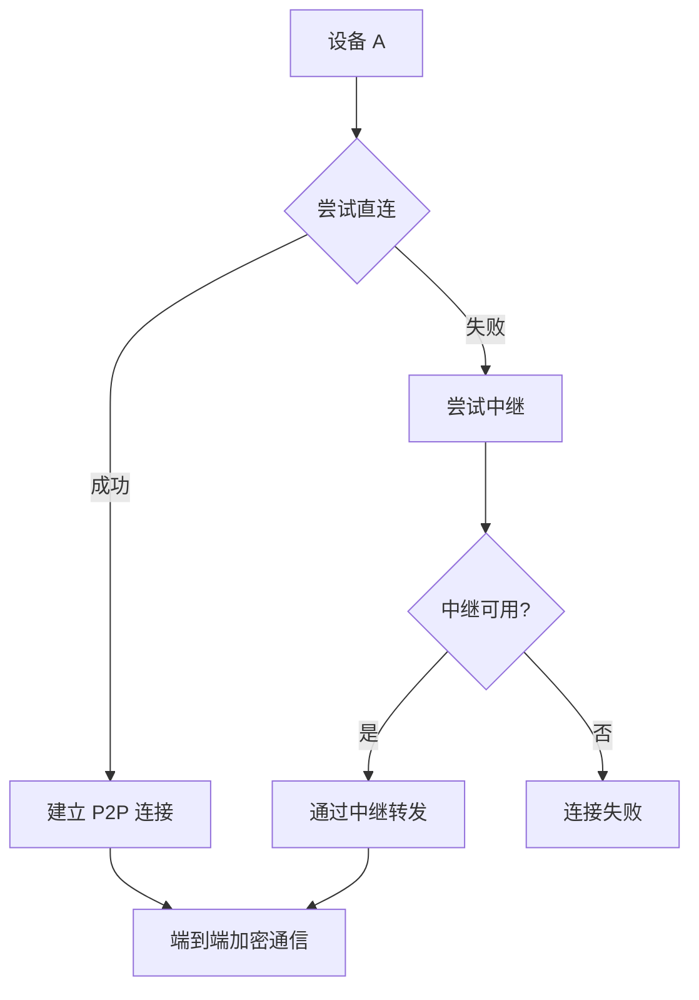

# P2P 端到端加密通信设计

## 概述

实现真正的 P2P 网络通信，设备直接连接（NAT穿透），仅在无法直连时使用中继服务器。流量端到端加密，中继服务器无法解密内容。

## 网络拓扑

```
┌─────────────────────────────────────────────────────────────────┐
│                        P2P 网络                                  │
│                                                                 │
│   ┌─────────┐                              ┌─────────┐          │
│   │  设备 A  │◄──── 直连 (NAT穿透) ────►  │  设备 B  │          │
│   │         │                              │         │          │
│   │ (公钥A) │                              │ (公钥B) │          │
│   │ (私钥A) │                              │ (私钥B) │          │
│   └────┬────┘                              └────┬────┘          │
│        │                                        │               │
│        │        ┌─────────────────┐            │               │
│        └───────►│    中继服务器    │◄───────────┘               │
│                 │   (只看得到密文)  │                             │
│                 └─────────────────┘                             │
│                       (fallback)                               │
└─────────────────────────────────────────────────────────────────┘
```

## 连接流程



## NAT 穿透技术

### STUN (Session Traversal Utilities for NAT)

```
设备 A ──> STUN 服务器 ──> 获取公网 IP:Port
设备 B ──> STUN 服务器 ──> 获取公网 IP:Port

使用公网地址直接尝试连接
```

### TURN (Traversal Using Relays around NAT)

```
当 STUN 失败时：
设备 A ──> TURN 服务器 ──> 转发到设备 B
设备 B ──> TURN 服务器 ──> 转发到设备 A

所有流量经过 TURN 服务器（类似中继）
```

### ICE (Interactive Connectivity Establishment)

```
ICE 候选列表（按优先级排序）：
1. 主机地址 (192.168.x.x) - 本地网络
2. STUN 地址 (公网IP:Port) - NAT穿透成功
3. TURN 地址 (中继服务器) - 最后 fallback

尝试最高优先级候选，成功即停止
```

## 端到端加密

### 密钥交换 (X25519 Diffie-Hellman)

```
设备 A: 生成密钥对 (公钥A, 私钥A)
设备 B: 生成密钥对 (公钥B, 私钥B)

交换公钥后：
共享密钥 K = X25519(私钥A, 公钥B) = X25519(私钥B, 公钥A)

用 K 加密后续所有通信
```

### 消息加密 (AES-256-GCM)

```
发送：
1. 生成随机 IV (12 bytes)
2. ciphertext = AES-GCM(K, plaintext, IV)
3. 发送 [IV + ciphertext + auth_tag]

接收：
1. 提取 IV
2. plaintext = AES-GCM-Decrypt(K, ciphertext, IV, auth_tag)
```

## 协议设计

### 消息格式

```dart
class P2PMessage {
  final String senderId;           // 发送者设备 ID
  final String receiverId;         // 接收者设备 ID
  final Uint8List encryptedPayload; // 加密内容 (IV + ciphertext + tag)
  final int timestamp;            // 时间戳
  final String messageId;         // 消息唯一 ID (防重放)
}

class SignalingMessage {
  final String senderId;
  final String type;  // 'offer' | 'answer' | 'ice_candidate'
  final dynamic payload;  // SDP 或 ICE 候选
}
```

### 信令 (Signaling) 流程

```
设备 A                          中继服务器                         设备 B
   │                                │                               │
   │──── 发送 offer (公钥A) ───────>│                               │
   │                                │──── 转发 offer ───────────────>│
   │                                │                               │
   │                                │<─── 发送 answer (公钥B) ──────│
   │<─── 转发 answer ───────────────│                               │
   │                                │                               │
   │<──────────────────── ICE 候选交换 ──────────────────────────>│
   │                                │                               │
   │======= 建立直接 P2P 连接 (流量加密) ========>                  │
   │                                │                               │
```

## 中继服务器职责

| 职责 | 说明 |
|------|------|
| 信令转发 | 转发 WebRTC offer/answer/ICE candidate |
| 消息中继 | 仅当 P2P 直连失败时转发密文 |
| TURN 服务 | 提供中继候选地址 |
| **不参与** | 解密、加密、密钥生成、会话管理 |

## 完整流程

```
1. 交换公钥 (通过中继服务器)
   A → 中继 → B: "这是我的公钥 A"
   B → 中继 → A: "这是我的公钥 B"

2. 协商连接 (ICE)
   A → 中继 → B: offer (SDP)
   B → 中继 → A: answer (SDP)
   A ↔ 中继 ↔ B: ICE candidates

3. 建立 P2P 连接
   成功 → 使用直连通道
   失败 → fallback 到中继

4. 端到端加密通信
   A → B: Encrypt(Encrypt(content, K), 公钥B)
   B → A: Encrypt(Encrypt(content, K), 公钥A)
```

## 实现方案选择

| 方案 | 复杂度 | 适用场景 |
|------|--------|----------|
| WebRTC | 高 | 浏览器 + App |
| libp2p | 中 | 有库支持 |
| 自实现 (STUN+TURN) | 高 | 完全控制 |

## 版本历史

| 版本 | 日期 | 说明 |
|------|------|------|
| 1.0 | 2026-04-05 | 初始版本 |
