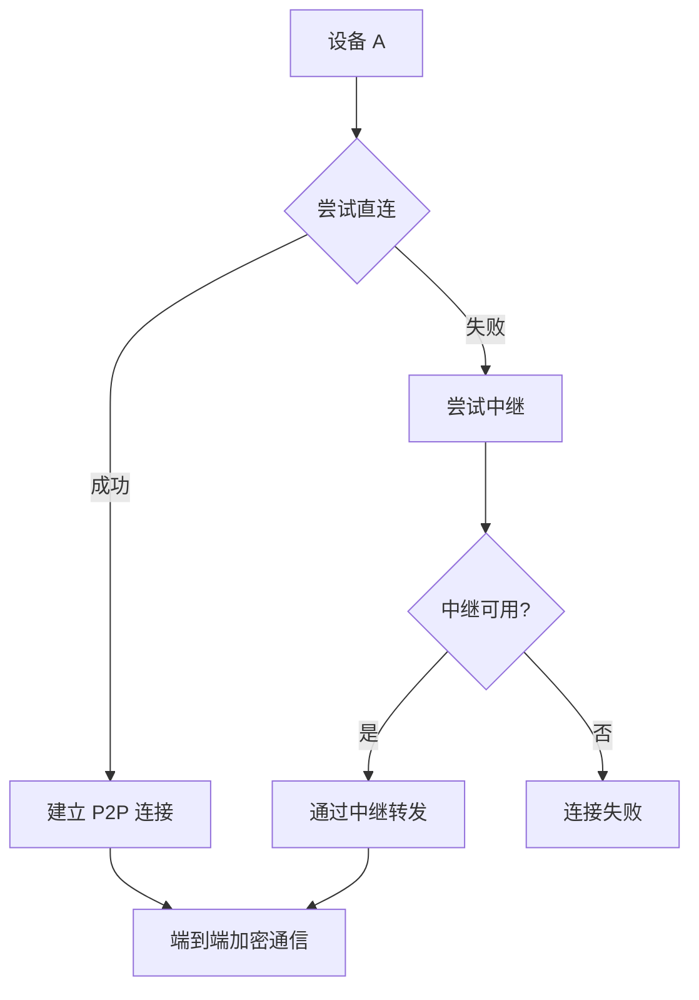

# P2P 端到端加密通信设计

## 概述

实现真正的 P2P 网络通信，设备直接连接（NAT穿透），仅在无法直连时使用中继服务器。流量端到端加密，中继服务器无法解密内容。

## 网络拓扑

```
┌─────────────────────────────────────────────────────────────────┐
│                        P2P 网络                                  │
│                                                                 │
│   ┌─────────┐                              ┌─────────┐          │
│   │  设备 A  │◄──── 直连 (NAT穿透) ────►  │  设备 B  │          │
│   │         │                              │         │          │
│   │ (公钥A) │                              │ (公钥B) │          │
│   │ (私钥A) │                              │ (私钥B) │          │
│   └────┬────┘                              └────┬────┘          │
│        │                                        │               │
│        │        ┌─────────────────┐            │               │
│        └───────►│    中继服务器    │◄───────────┘               │
│                 │   (只看得到密文)  │                             │
│                 └─────────────────┘                             │
│                       (fallback)                               │
└─────────────────────────────────────────────────────────────────┘
```

## 连接流程



## NAT 类型与行为

### 四种 NAT 类型

```
┌─────────────────────────────────────────────────────────────────┐
│                        NAT 类型                                   │
├─────────────────────────────────────────────────────────────────┤
│                                                                  │
│   端点无关   │   受限锥型    │   端口受限锥型   │   对称型      │
│  (Full Cone) │  (Restricted)│  (Port-Restricted)│ (Symmetric) │
│                                                                  │
│     ▲▲▲      │     ▲◆       │      ▲◆◆        │    ▲◇       │
│                                                                  │
│  防火墙最松   │   较严格     │     较严格        │  防火墙最严  │
└─────────────────────────────────────────────────────────────────┘
```

| NAT 类型 | 入站规则 | 穿透难度 |
|----------|----------|----------|
| 完全锥型 | 任何外部IP:Port | ★☆☆ (最易) |
| 受限锥型 | 仅信任的外部IP | ★★☆ |
| 端口受限锥型 | 仅信任的IP:Port | ★★★ |
| 对称型 | 每个目标不同映射 | ★★★★ (最难) |

### NAT 映射行为

```
对称型 NAT 示例：

设备 A (192.168.1.10:5000)
    │
    ├──> 目标 1.1.1.1:80   → 映射到 101.101.1.10:6000
    │
    ├──> 目标 2.2.2.2:80   → 映射到 101.101.1.10:6001  (端口不同!)
    │
    └──> 目标 3.3.3.3:80   → 映射到 101.101.1.10:6002  (端口不同!)

对称型 NAT 问题：无法预测映射端口，P2P 连接极难建立
```

## NAT 穿透技术

### NAT 穿透原理

```
问题：内网设备没有公网 IP:Port，如何被外网设备访问？

解决：让双方同时向外网发送数据包，NAT 会创建映射规则
      这叫做 "伪装的直连"

设备 A                    NAT A                      NAT B                    设备 B
  │                         │                         │                         │
  │──── UDP 包 ────────────>│                         │                         │
  │    (src: A:5000        │                         │                         │
  │     dst: STUN:3478)    │                         │                         │
  │                         │──── UDP 包 ────────────>│                         │
  │                         │    (src: 公网A:6000   │                         │
  │                         │     dst: STUN:3478)   │                         │
  │                         │                         │                         │
  │                         │<──── UDP 包 ───────────│                         │
  │                         │    (src: 公网B:7000   │                         │
  │<──── UDP 包 ────────────│     dst: 公网A:6000)  │                         │
  │    (建立映射关系!)      │                         │                         │
```

### UDP 打洞 (UDP Hole Punching)

```
场景：两个内网客户端 A 和 B，都通过 NAT 连接

步骤 1: 各自连接 STUN 服务器，获知自己的公网地址

步骤 2: A → B 发送 UDP 包（NAT A 创建入站映射）
        B → A 发送 UDP 包（NAT B 创建入站映射）

步骤 3: 如果双方都在受限锥型 NAT 后
        A 的公网地址收到来自 B 的包会被 NAT A 允许入站
        B 的公网地址收到来自 A 的包会被 NAT B 允许入站

结果：直连建立！
```

### STUN (Session Traversal Utilities for NAT)

```
STUN 服务器职责：
1. 响应客户端请求，告知其公网 IP:Port
2. 检测 NAT 类型

典型 STUN 服务器：
- Google: stun.l.google.com:19302
- Twilio: global.stun.twilio.com:3478

设备 A ──> STUN ──> 获知: 公网A:6000
设备 B ──> STUN ──> 获知: 公网B:7000

使用公网地址直接尝试连接
```

### TURN (Traversal Using Relays around NAT)

```
当 STUN 完全失败时（对称型 NAT）：
设备 A ──> TURN 服务器 ──> 转发到设备 B
设备 B ──> TURN 服务器 ──> 转发到设备 A

所有流量经过 TURN 服务器（实际就是中继）
```

### ICE (Interactive Connectivity Establishment)

```
ICE 候选列表（按优先级排序）：

  优先级高
  ├── 主机候选: 192.168.1.10:5000 (本地网络)
  ├── 服务器反射候选: 公网A:6000 (STUN 获取)
  ├── 对等反射候选: 公网B:7000 (P2P 直连)
  │
  └── 中继候选: TURN服务器:8000 (最后 fallback)
  优先级低

尝试最高优先级候选，成功即停止
```

### 穿透成功条件

```
╔═══════════════════════════════════════════════════════════╗
║                 穿透成功条件                            ║
╠═══════════════════════════════════════════════════════════╣
║                                                       ║
║  至少一方不是对称型 NAT                                ║
║                                                       ║
║  或                                                   ║
║                                                       ║
║  双方都是相同类型的受限 NAT（可预测端口映射）           ║
║                                                       ║
╚═══════════════════════════════════════════════════════════╝

穿透失败场景：
1. 双方都是对称型 NAT
2. 一方在对称型 NAT 后，另一方在任何 NAT 后
3. 防火墙完全阻止 UDP
```

## 端到端加密

### 密钥交换 (X25519 Diffie-Hellman)

```
设备 A: 生成密钥对 (公钥A, 私钥A)
设备 B: 生成密钥对 (公钥B, 私钥B)

交换公钥后：
共享密钥 K = X25519(私钥A, 公钥B) = X25519(私钥B, 公钥A)

用 K 加密后续所有通信
```

### 消息加密 (AES-256-GCM)

```
发送：
1. 生成随机 IV (12 bytes)
2. ciphertext = AES-GCM(K, plaintext, IV)
3. 发送 [IV + ciphertext + auth_tag]

接收：
1. 提取 IV
2. plaintext = AES-GCM-Decrypt(K, ciphertext, IV, auth_tag)
```

## 协议设计

### 消息格式

```dart
class P2PMessage {
  final String senderId;           // 发送者设备 ID
  final String receiverId;         // 接收者设备 ID
  final Uint8List encryptedPayload; // 加密内容 (IV + ciphertext + tag)
  final int timestamp;            // 时间戳
  final String messageId;         // 消息唯一 ID (防重放)
}

class SignalingMessage {
  final String senderId;
  final String type;  // 'offer' | 'answer' | 'ice_candidate'
  final dynamic payload;  // SDP 或 ICE 候选
}
```

### 信令 (Signaling) 流程

```
设备 A                          中继服务器                         设备 B
   │                                │                               │
   │──── 发送 offer (公钥A) ───────>│                               │
   │                                │──── 转发 offer ───────────────>│
   │                                │                               │
   │                                │<─── 发送 answer (公钥B) ──────│
   │<─── 转发 answer ───────────────│                               │
   │                                │                               │
   │<──────────────────── ICE 候选交换 ──────────────────────────>│
   │                                │                               │
   │======= 建立直接 P2P 连接 (流量加密) ========>                  │
   │                                │                               │
```

## 中继服务器职责

| 职责 | 说明 |
|------|------|
| 信令转发 | 转发 WebRTC offer/answer/ICE candidate |
| 消息中继 | 仅当 P2P 直连失败时转发密文 |
| TURN 服务 | 提供中继候选地址 |
| **不参与** | 解密、加密、密钥生成、会话管理 |

## 完整流程

```
1. 交换公钥 (通过中继服务器)
   A → 中继 → B: "这是我的公钥 A"
   B → 中继 → A: "这是我的公钥 B"

2. 协商连接 (ICE)
   A → 中继 → B: offer (SDP)
   B → 中继 → A: answer (SDP)
   A ↔ 中继 ↔ B: ICE candidates

3. 建立 P2P 连接
   成功 → 使用直连通道
   失败 → fallback 到中继

4. 端到端加密通信
   A → B: Encrypt(Encrypt(content, K), 公钥B)
   B → A: Encrypt(Encrypt(content, K), 公钥A)
```

## 实现方案选择

| 方案 | 复杂度 | 适用场景 |
|------|--------|----------|
| WebRTC | 高 | 浏览器 + App |
| libp2p | 中 | 有库支持 |
| 自实现 (STUN+TURN) | 高 | 完全控制 |

## 版本历史

| 版本 | 日期 | 说明 |
|------|------|------|
| 1.1 | 2026-04-05 | 扩展 NAT 类型、UDP打洞原理、穿透成功条件 |
| 1.0 | 2026-04-05 | 初始版本 |
