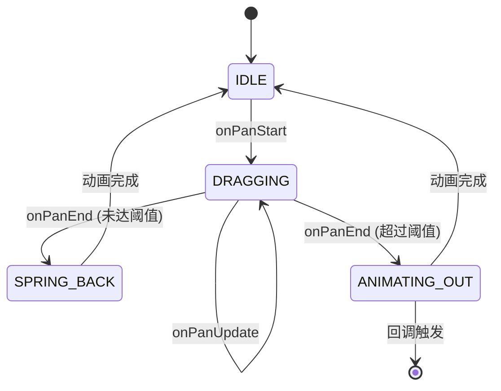
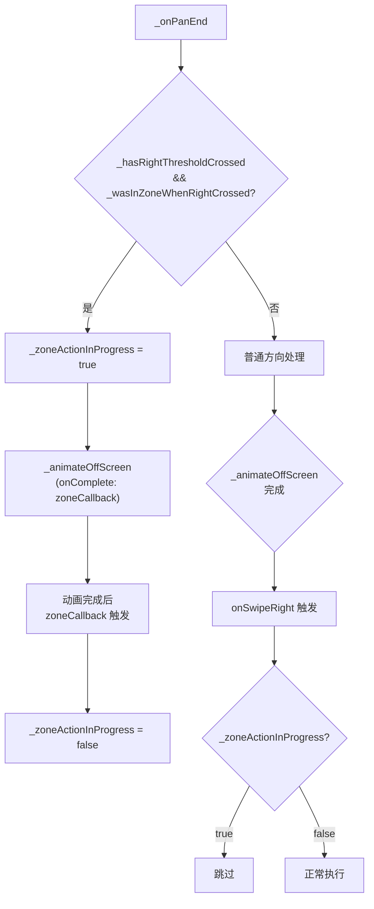
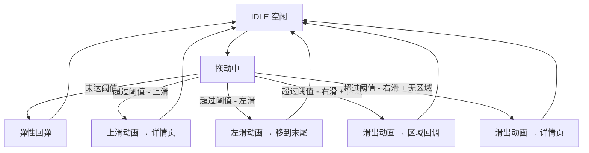

# Flutter 拖动交互设计

## 背景

基于 `word_drag` 模块的弹性拖动背单词应用，总结 Flutter 中实现流畅拖动交互的核心技术。

## 核心组件

**文件:** `lib/core/word_drag/widgets/draggable_word_card.dart`

### 关键属性

| 属性 | 默认值 | 作用 |
|------|--------|------|
| `swipeThreshold` | 0.25 | 滑动触发阈值（屏幕宽度的 25%） |
| `rotationFactor` | 0.0015 | 旋转角度系数 |
| `scaleFactor` | 0.92 | 拖动时卡片缩小比例 |
| `spring.stiffness` | 400.0 | 弹簧刚度 |
| `spring.damping` | 22.0 | 弹簧阻尼 |

### 丝滑感来源

1. **无延迟跟随** - `_dragOffset += details.delta` 直接累加，无滤波延迟
2. **旋转反馈** - 卡片随拖动方向微微倾斜，增强物理感
3. **缩放反馈** - 拖动时缩小 8%，暗示"提起"操作
4. **边界阻尼** - 超出边界后有阻力，但不打断手势
5. **弹性回弹** - 未达阈值时 `Curves.elasticOut` 提供真实回弹感

## 组件生命周期

### DraggableWordCard 状态机



### 方法执行周期

```
onPanStart()
  → 重置动画状态
  → 设置 _isDragging = true
  → 重置 _hasRightThresholdCrossed, _wasInZoneWhenRightCrossed

onPanUpdate()
  → 更新 _dragOffset
  → 计算横向进度 → 通知 parent 显示区域
  → 检测右滑阈值首次交叉 → 捕获区域状态
  → 调用 onCardPositionChanged → parent 更新 _isInMarkZone/_isInDeleteZone

onPanEnd()
  → 重置横向进度
  → 判定滑动方向
  → [区域触发] → 滑出动画 → 动画完成后调用区域回调
  → [非区域右滑] → 滑出动画 → 动画完成后调用 onSwipeRight
  → [其他方向] → 滑出动画 → 动画完成后调用对应回调
  → [未达阈值] → 弹性回弹 → onSpringBackComplete

_animateOffScreen(direction, onComplete)
  → 计算目标偏移 (screenWidth * 1.5)
  → 创建 Tween → CurvedAnimation
  → 300ms easeOut 动画
  → 动画完成后根据 direction 调用对应回调 + onComplete

_springBack()
  → 600ms elasticOut 回弹到原点
  → 动画完成后调用 onSpringBackComplete
```

### WordDragPage 回调链

```
卡片释放于区域
  └→ _animateOffScreen(right, onComplete: zoneCallback)
       └→ 300ms 动画完成后
            └→ zoneCallback (onMarkZoneAction / onDeleteZoneAction)
                 └→ 显示成功提示 (2秒后自动隐藏)
                 └→ 执行单词操作 (移动到末尾 / 删除)

卡片释放于非区域右滑
  └→ _animateOffScreen(right)
       └→ 300ms 动画完成后
            └→ widget.onSwipeRight → _navigateToDetail
```

## 核心实现

### 1. 动画控制器

```dart
// lib/core/word_drag/widgets/draggable_word_card.dart:69
_controller = AnimationController.unbounded(vsync: this);
// unbounded 允许值超出 0-1 范围，用于弹性动画
```

### 2. 拖动变换

```dart
// lib/core/word_drag/widgets/draggable_word_card.dart:252-257
Transform(
  alignment: Alignment.center,
  transform: Matrix4.identity()
    ..translate(_dragOffset.dx, _dragOffset.dy)  // 位移
    ..rotateZ(rotation)  // 旋转：随拖动距离变化
    ..scale(scale.clamp(0.85, 1.0)),  // 缩放：拖动时缩小
)
```

### 3. 旋转角度计算

```dart
// lib/core/word_drag/widgets/draggable_word_card.dart:238
final rotation = dampedOffset.dx * widget.rotationFactor;
// rotationFactor = 0.0015
// 向右拖 100px → 旋转约 8.5°
```

### 4. 边界阻尼

```dart
// lib/core/word_drag/widgets/draggable_word_card.dart:267-276
double _calculateDamping(double offset, double maxExtent) {
  final absOffset = offset.abs();
  if (absOffset > maxExtent) {
    final excess = absOffset - maxExtent;
    final dampedExcess = excess / (excess + maxExtent * 0.3);
    return 1.0 - dampedExcess * 0.5;  // 最大50%阻力
  }
  return 1.0;
}
// 超出边界后手指移动"打折"，产生被拉住的感觉
```

### 5. 弹性回弹

```dart
// lib/core/word_drag/widgets/draggable_word_card.dart:153-170
void _springBack() {
  _controller.stop();
  _animation = Tween<Offset>(
    begin: _dragOffset,
    end: Offset.zero,
  ).animate(CurvedAnimation(
    parent: _controller,
    curve: Curves.elasticOut,  // 弹性曲线
  ));
  _controller
    ..value = 0.0
    ..animateTo(1.0, duration: const Duration(milliseconds: 600));
}
```

### 6. 方向判定

```dart
// lib/core/word_drag/widgets/draggable_word_card.dart:131-141
// 上滑：垂直偏移 > 水平偏移 * 1.5 且向下
if (_dragOffset.dy < -thresholdY &&
    _dragOffset.dy.abs() > _dragOffset.dx.abs() * 1.5) {
  direction = SwipeDirection.up;
}
// 右滑：水平偏移 > 阈值
else if (_dragOffset.dx > thresholdX) {
  direction = SwipeDirection.right;
}
```

## 区域检测机制

### 标新/删除区布局

```
屏幕右侧:
┌─────────────────────┬────┐
│                     │ 标新│  ← screenHeight * 0.15
│                     │     │
│                     ├────┤
│                     │    │
│                     │    │
│                     │ 删除│  ← screenHeight * 0.60
│                     │     │
└─────────────────────┴────┘
     卡片区域          80px
```

### 区域检测时机

| 阶段 | 检测方式 | 说明 |
|------|----------|------|
| `onPanUpdate` | `onCardPositionChanged` 回调 | parent setState 更新 _isInMarkZone/_isInDeleteZone |
| `onPanEnd` 区域触发 | `_checkZoneAtRelease()` 直接计算 | 不依赖 parent 状态，避免时序问题 |

### _checkZoneAtRelease() 实现

```dart
// lib/core/word_drag/widgets/draggable_word_card.dart:138-163
int _checkZoneAtRelease() {
  final screenSize = MediaQuery.of(context).size;
  final screenWidth = screenSize.width;
  final screenHeight = screenSize.height;
  final cardCenter = _getCardCenter();

  // 标新区：右侧上方 (inflate 30 扩大检测范围)
  final markZoneRect = Rect.fromLTWH(
    screenWidth - 100, screenHeight * 0.15, 80, screenHeight * 0.25
  ).inflate(30);

  // 删除区：右侧下方
  final deleteZoneRect = Rect.fromLTWH(
    screenWidth - 100, screenHeight * 0.60, 80, screenHeight * 0.25
  ).inflate(30);

  if (markZoneRect.contains(cardCenter)) return 1; // 标新区
  if (deleteZoneRect.contains(cardCenter)) return 2; // 删除区
  return 0; // 无区域
}
```

## 回调优先级机制

### 问题背景

右滑时可能同时满足：
1. 进入标新/删除区域（应触发区域回调）
2. 方向被判断为 up（左上滑，可能走详情页）

### 解决策略



### _zoneActionInProgress 标志

```dart
// lib/core/word_drag/widgets/draggable_word_card.dart:79
bool _zoneActionInProgress = false; // 阻止重复触发 onSwipeRight

// _animateOffScreen 中
case SwipeDirection.right:
  if (!_zoneActionInProgress) {
    widget.onSwipeRight?.call();
  }
  break;
```

## 状态流程



## Bug 修复记录

### Bug: 滑动后卡片不消失/不返回

**问题描述：** 连续滑动时卡片不动画直接停在原地。

**根本原因：** `AnimationController.unbounded` 的值在动画完成后停留在 1.0，再次调用 `animateTo(1.0)` 时不会启动新动画。

**修复方案：** 每次启动动画前调用 `_controller.value = 0.0` 重置值。

```dart
// 修复前
_controller.reset();
_controller.animateTo(1.0, ...);

// 修复后
_controller
  ..value = 0.0
  ..animateTo(1.0, duration: const Duration(milliseconds: 300));
```

### Bug: 单词滑动后新的单词不显示

**问题描述：** 单词滑动后屏幕空白。

**根本原因：** `_currentIndex` 在删除单词后可能越界，`_buildCardStack` 没有边界检查。

**修复方案：** 添加双重检查确保索引有效。

```dart
// lib/core/word_drag/pages/word_drag_page.dart:351-354
Widget _buildCardStack() {
  if (_words.isEmpty || _currentIndex >= _words.length) {
    return _buildEmptyState();
  }
  // ...
}
```

### Bug: 区域释放时仍触发详情页

**问题描述：** 在标新/删除区域释放，但卡片继续滚动触发详情页。

**根本原因：** 斜向拖动时 `dy` 成分可能大于 `dx * 1.5`，方向被判断为 `up` 而非 `right`。

**修复方案：** 在 `_onPanEnd` 中优先检查 `_wasInZoneWhenRightCrossed`，如果为 true 则忽略方向判断，直接执行区域回调。

### Bug: 区域回调与详情页回调重复触发

**问题描述：** 区域释放时 `onSwipeRight` 和 `onMarkZoneAction` 同时被触发。

**根本原因：** `_animateOffScreen` 内部对 right 方向总是调用 `onSwipeRight`。

**修复方案：** 添加 `_zoneActionInProgress` 标志，区域触发时设为 true，阻止 `onSwipeRight` 被调用。

## 交互设计原则

1. **安全操作** - 删除等不可逆操作必须拖入目标区域才执行
2. **即时反馈** - 拖动时立即响应，无延迟
3. **视觉暗示** - 通过旋转、缩放暗示操作结果
4. **物理真实** - 弹性回弹模拟真实物理效果
5. **动画连贯** - 操作完成后卡片滑出，下一张卡片自然出现

## 回调签名一览

| 回调 | 签名 | 触发时机 |
|------|------|----------|
| `onSwipeLeft` | `VoidCallback?` | 左滑动画完成后 |
| `onSwipeRight` | `VoidCallback?` | 非区域右滑动画完成后 |
| `onMarkZoneAction` | `VoidCallback?` | 标新区域释放动画完成后 |
| `onDeleteZoneAction` | `VoidCallback?` | 删除区域释放动画完成后 |
| `onSwipeUp` | `VoidCallback?` | 上滑动画完成后 |
| `onHorizontalDragProgress` | `Function(double)?` | 拖动过程中实时更新 |
| `onCardPositionChanged` | `bool Function(...)?` | 拖动过程中实时更新 |
| `onSpringBackComplete` | `VoidCallback?` | 弹性回弹动画完成后 |

## 版本历史

| 版本 | 日期 | 说明 |
|------|------|------|
| 1.3 | 2026-04-06 | 新增：组件生命周期、区域检测机制、回调优先级机制 |
| 1.2 | 2026-04-06 | 新增：Bug 修复记录 - 区域释放时仍触发详情页、回调重复触发 |
| 1.1 | 2026-04-06 | 新增：状态流程图、Bug 修复 - 滑动后单词不显示 |
| 1.0 | 2026-04-06 | 初始版本，记录 word_drag 拖动交互设计 |
